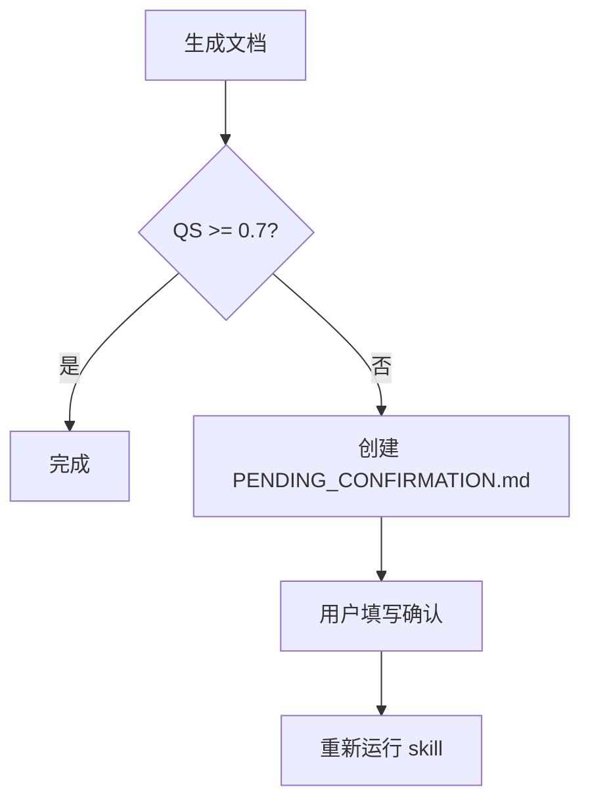

# Changelog

All notable changes to the autodocs skill will be documented in this file.

## [2.0.0] - 2026-03-26

### 🏷️ Branding

- **Skill 重命名**: `doc-autoresearch` → `autodocs`
  - 更简洁直观
  - 强调"自动化"特性
  - 与输出目录 `.autodocs/` 保持一致

### 🔴 Breaking Changes

#### 1. 可信度标记系统重构

**旧版本（v1.x）：**
```markdown
[✅] 已验证（人工确认）
[⚙️] 自动提取（从代码）
[❓] 推测（AI 假设）
[🚫] 未知（待补充）
```

**新版本（v2.0）：**
```markdown
[✅ 已验证] - 代码已读取确认（自动化）
[⚙️ 自动提取] - 从配置/结构提取
[❓ 推测] - 基于模式推测
[🚫 未知] - 无法确定
```

**变更原因：**
- ❌ 移除"人工确认"概念（自动化工作流无需人工介入）
- ✅ 强调段落级标记（而非文档级）
- ✅ 明确标记含义（已验证 ≠ 人工确认）

#### 2. QS 阈值调整

| 指标 | 旧阈值 | 新阈值 |
|------|--------|--------|
| 合格 | QS >= 0.5 | QS >= 0.7 |
| 良好 | QS >= 0.8 | QS >= 0.8 |
| 优秀 | QS >= 0.9 | - |

**变更原因：**
- 提高文档质量门槛
- QS < 0.7 时自动触发人工确认流程

---

### ✨ New Features

#### 1. 段落级可信度标记

每个段落都可以独立标记可信度：

```markdown
[✅ 已验证] 这是一个消息队列处理循环（见 [main.cr:122](./src/main.cr#L122)）。

[⚙️ 自动提取] 依赖项：kemal（从 shard.yml 提取）。

[❓ 推测] 可能支持重试机制（见 [queue.cr:45](./src/queue.cr#L45)）。

[🚫 未知] 错误处理流程待确认。
```

#### 2. 人工确认文档机制

当 QS < 0.7 时，自动创建 `.autodocs/PENDING_CONFIRMATION.md`：

```markdown
# 📋 人工确认文档：项目架构说明

**状态**: 🔴 待确认
**当前 QS**: 0.65

## 需确认项列表

- [ ] **消息队列重试机制**
  - 推测：可能支持重试
  - 需确认：重试策略是什么？

- [ ] **错误处理流程**
  - 问题：错误分类不明确
  - 需确认：错误分级标准？
```

**工作流：**


#### 3. Python 环境说明

- ✅ 仅使用 Python 标准库（无第三方依赖）
- ✅ 兼容 Python 3.6+
- ✅ 无需虚拟环境
- 📝 添加了虚拟环境方案（未来扩展用）

#### 4. 代码链接格式增强

新增表格行号范围格式：

```markdown
| 文件 | 行号 | 功能 |
|------|------|------|
| [main.cr](./src/main.cr#L10) | [L10-25](./src/main.cr#L10) | 初始化配置 |
```

---

### 📝 Documentation Updates

#### SKILL.md

- ✅ 重写"核心理念"部分
- ✅ 新增"人工确认文档机制"
- ✅ 更新 QS 计算权重
- ✅ 更新代码链接格式示例
- ✅ 更新使用场景（增加"代码导读"）

#### references/program.md

- ✅ 重写"三大支柱"
- ✅ 新增"段落级可信度标记"示例
- ✅ 新增"人工确认文档机制"
- ✅ 新增"Python 环境说明"
- ✅ 更新约束列表（新增"不能等待人工确认"）

#### scripts/verify.py

- ✅ 支持新可信度标记格式（`[✅ 已验证]`）
- ✅ 兼容旧格式（`[✅]`）
- ✅ 更新诚实度检查逻辑
- ✅ 更新 QS 阈值（0.5 → 0.7）
- ✅ 更新改进建议信息

---

### 🔧 Technical Details

#### QS 计算权重调整

| 维度 | 旧权重 | 新权重 |
|------|--------|--------|
| Structure | 25% | 20% |
| Honesty | 35% | 30% |
| Accessibility | 15% | 15% |
| LinkValidity | 15% | 20% |
| VisualQuality | 10% | 15% |

#### Python 依赖检查

```python
import re        # 标准库
import sys       # 标准库
from pathlib import Path      # 标准库
from datetime import datetime # 标准库
```

**结论：** 无第三方依赖，无需 `pip install`。

---

### 📚 Migration Guide

#### 从 v1.x 升级到 v2.0

1. **更新可信度标记**：
   - 旧：`[✅] 内容`
   - 新：`[✅ 已验证] 内容`

2. **调整 QS 预期**：
   - 旧：QS >= 0.5 合格
   - 新：QS >= 0.7 合格

3. **处理人工确认文档**：
   - 如果 QS < 0.7，会自动创建 `PENDING_CONFIRMATION.md`
   - 填写确认项后重新运行 skill

---

### 🎯 Summary

| 类别 | 变更数 |
|------|--------|
| Breaking Changes | 2 |
| New Features | 4 |
| Documentation Updates | 3 |
| Technical Improvements | 2 |

**核心改进：**
- ✅ 完全自动化工作流（无需人工介入）
- ✅ 段落级可信度标记
- ✅ 自动触发人工确认机制
- ✅ 零第三方依赖

---

**维护者**: Sisyphus Agent  
**更新时间**: 2026-03-26
