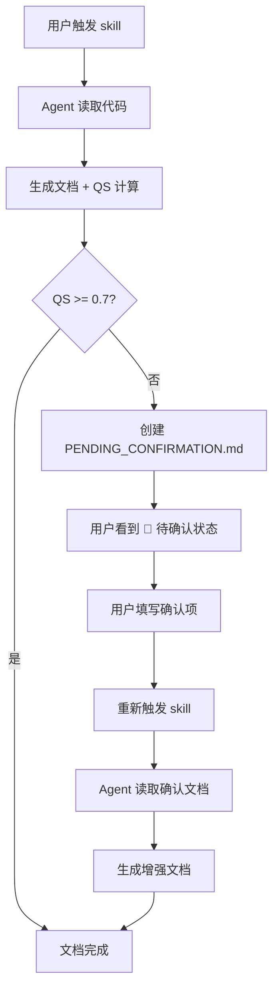
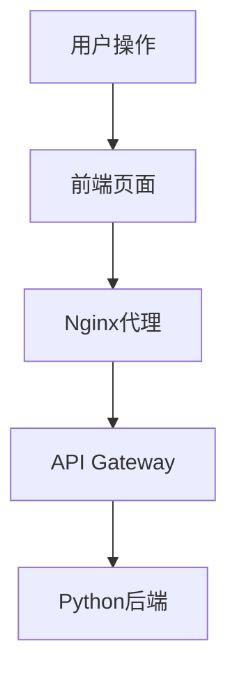
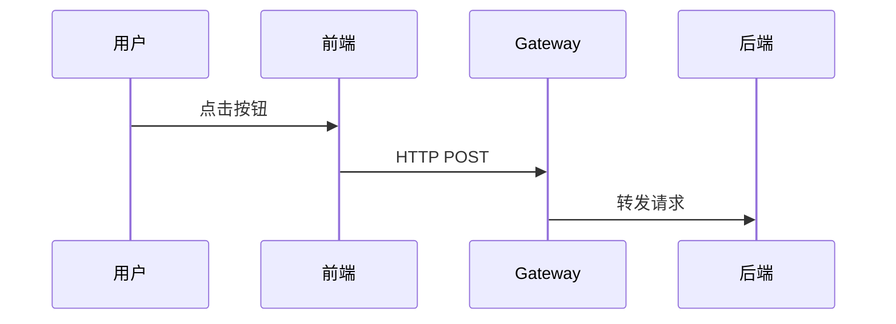
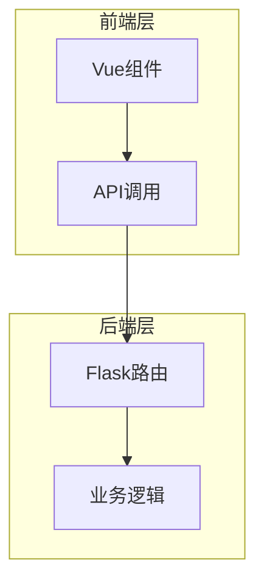
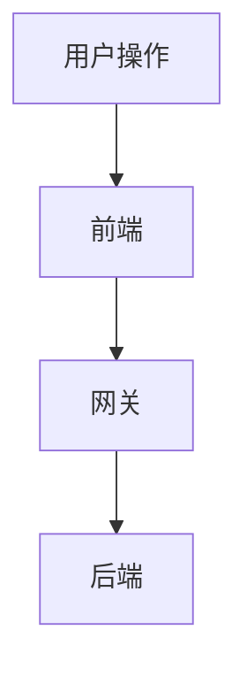
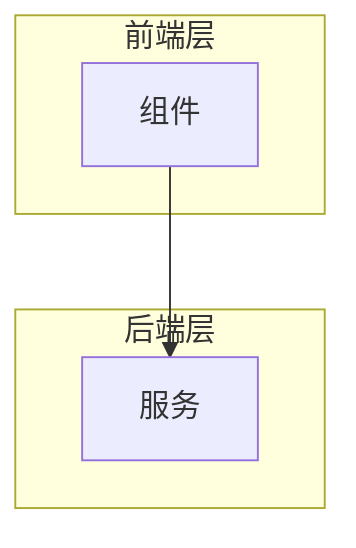
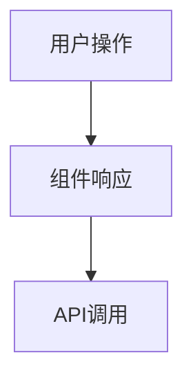

# Autodocs

> 自动化文档生成系统，强调**段落级可信度标记**、**精确代码定位**与**可视化架构**

## 核心理念

**不是追求「完整」，而是追求「诚实」、「可追溯」与「可视化」**

大多数 AI 文档生成工具试图填满所有章节，但现实中的项目是混乱的。AI 于是开始编造。

Autodocs 用三大支柱确保文档质量：

### 支柱 1: 段落级可信度标记系统

**每个内容段落都必须标记可信度：**

| 标记 | 含义 | 使用场景 | 示例 |
|------|------|----------|------|
| `[✅ 已验证]` | 代码已读取确认 | 直接从代码中读取并验证的内容 | `[✅ 已验证] 这是一个消息队列处理循环（见 [main.cr:122](./src/main.cr#L122)）` |
| `[⚙️ 自动提取]` | 从配置/结构提取 | 从 package.json、目录结构、注释等自动提取 | `[⚙️ 自动提取] 依赖：kemal（从 shard.yml 提取）` |
| `[❓ 推测]` | 基于模式推测 | 无法从代码确认但根据模式可能存在 | `[❓ 推测] 可能支持 WebSocket（见 [routes.cr:45](./src/routes.cr#L45)）` |
| `[🚫 未知]` | 无法确定 | 确实无法从现有信息确定的内容 | `[🚫 未知] 错误处理流程待确认` |

**段落级标记示例：**

```markdown
## 核心模块

[✅ 已验证] 调度器模块是一个循环处理消息队列的逻辑（见 [scheduler.cr:122](./src/scheduler.cr#L122)）。
代码结构如下：
\`\`\`crystal
loop do
  message = queue.receive()
  process(message)
end
\`\`\`

[⚙️ 自动提取] 依赖项列表：
- kemal (从 shard.yml 提取)
- redis (从 shard.yml 提取)

[❓ 推测] 可能支持消息重试机制（见 [queue.cr:45](./src/queue.cr#L45)），但未找到明确实现。

[🚫 未知] 以下内容无法从现有代码确定：
- 错误处理流程
- 性能瓶颈点
- 高可用方案
```

**自动化工作流原则：**
- ✅ 仅从现有代码/配置提取信息
- ✅ 所有推测必须注明依据
- ❌ 不编造无法验证的内容
- ❌ 不需要人工介入即可完成初始文档

### 人工确认文档机制

当自动化生成的文档可信度不足时（QS < 0.7），系统会自动创建人工确认文档：

**文件**: `.autodocs/PENDING_CONFIRMATION.md`

```markdown
# 📋 人工确认文档：项目架构说明

**状态**: 🔴 待确认
**创建时间**: 2026-03-26 14:30:00
**当前 QS**: 0.65

---

## 需确认项列表

### 🔴 高优先级（影响文档核心准确性）

- [ ] **消息队列重试机制**
  - 推测：可能支持重试（见 [queue.cr:45](./src/queue.cr#L45)）
  - 问题：未找到明确的重试次数和策略
  - 需确认：重试机制是否存在？具体策略是什么？

- [ ] **错误处理流程**
  - 推测：见 `rescue` 块（见 [handler.cr:78](./src/handler.cr#L78)）
  - 问题：错误分类和恢复策略不明确
  - 需确认：错误分级标准是什么？

### 🟡 中优先级（影响文档完整性）

- [ ] **性能瓶颈点**
  - 问题：无法从代码分析确定性能瓶颈
  - 需确认：已知性能问题点

---

## 确认后操作

1. 填写上述确认项
2. 重新运行 skill：`autodocs`
3. 系统将读取本文件并更新文档

---

**说明**: 自动化文档生成时无法确定以上内容，请人工确认后重新运行 skill。
```

**工作流：**



### 支柱 2: 精确代码链接系统

**所有代码引用必须使用精确链接格式：**

#### 格式 1: 单行引用
```markdown
[scheduler.cr:122](./projects/eulermaker-cbs/container/scheduler/app/scheduler/scheduler.cr#L122)
```

#### 格式 2: 行范围引用（表格中）
```markdown
| 行号 | 功能 |
|------|------|
| [L24-29](./src/main.cr#L24) | 初始化配置 |
| [L737-748](./src/main.cr#L737) | 全量构建事件处理 |
```

#### 格式 3: 文本内联引用
```markdown
核心函数 `create_pipline()` 定义在 [pipeline.py:39-54](./src/pipeline.py#L39)
```

**禁止模糊引用：**
- ❌ `在 scheduler.cr 中...`
- ❌ `scheduler 文件的某个函数`
- ✅ `[scheduler.cr:122](./path/to/scheduler.cr#L122)`

### 支柱 3: 可视化架构图

**使用 Mermaid 图表增强可理解性：**

#### 流程图 (flowchart)


#### 时序图 (sequenceDiagram)


#### 架构图（带子图）


## 执行步骤

### Step 1: 探索项目结构

首先了解项目布局：

```bash
# 查看项目根目录
ls -la

# 识别项目类型
ls package.json Cargo.toml go.mod pyproject.toml shard.yml 2>/dev/null

# 查看源码目录结构
tree -L 3 src/ lib/ app/ 2>/dev/null || find . -type f -name "*.cr" -o -name "*.py" -o -name "*.js" | head -50

# 获取项目根目录绝对路径（用于生成相对路径链接）
pwd
```

**记录项目根目录路径**（用于生成相对路径链接）。

### Step 2: 分析关键文件

识别需要文档化的核心代码：

```bash
# 查找主入口文件
find . -name "main.*" -o -name "app.*" -o -name "index.*" 2>/dev/null

# 查找配置文件
ls -la config/ src/config/ 2>/dev/null

# 查找 API/路由定义
grep -rn "def.*route\|router\|get\|post" --include="*.cr" --include="*.py" --include="*.js" | head -20
```

### Step 3: 生成目录结构

使用 `.autodocs/` 目录存放生成的文档：

```bash
# 创建文档目录结构
mkdir -p .autodocs/docs
```

### Step 4: 编写文档内容

遵循以下结构模板：

#### 模板 1: 代码导读文档

```markdown
# [项目名] [功能名] 代码导读

> **目标**: 通过 [场景描述]，深入导读整个代码流程
> **创建时间**: YYYY-MM-DD
> **更新时间**: YYYY-MM-DD

---

## 目录

- [整体流程概览](#整体流程概览)
- [Phase 1: xxx](#phase-1-xxx)
- [Phase 2: xxx](#phase-2-xxx)
- [附录](#附录)

---

## 整体流程概览



### 完整架构图



---

## Phase 1: [阶段名]

### 第 1 步：[步骤描述]

**文件**: [filename.ext](./path/to/filename.ext)

**关键代码位置**：

| 行号 | 功能 | 说明 |
|------|------|------|
| [L24-29](./path#L24) | 初始化配置 | 加载环境变量 |
| [L737-748](./path#L737) | 事件处理 | 处理用户点击 |

**核心代码**：

```typescript
// 从第 24 行开始
const config = loadConfig();

// 从第 737 行开始
async function handleBuild() {
  // ...
}
```

**数据流详解**：



---

## 附录

### 关键文件路径

```
项目结构/
├── src/
│   ├── main.cr
│   └── app/
└── config/
```

### 相关文档

- [其他文档](./other-doc.md)
```

#### 模板 2: 组件文档

```markdown
# [组件名]

## 概述

[✅] 这是一个 [描述] 的组件

## 架构


## 关键代码

| 文件 | 行号 | 功能 |
|------|------|------|
| [main.cr](./src/main.cr#L10) | [L10-25](./src/main.cr#L10) | 入口函数 |

## API

[⚙️] 从 [api.ts](./src/api.ts#L44) 提取：

```typescript
export const fetchData = () => http({ url: '/api/data' });
```

## 待补充

[🚫] 性能优化文档待补充
```

### Step 5: 验证文档质量

运行验证脚本检查：

```bash
cd .autodocs
python3 ../scripts/verify.py docs/
```

## 代码链接生成规范

### 如何生成正确的代码链接

**Step 1: 确定项目根目录**

```bash
PROJECT_ROOT=$(pwd)
```

**Step 2: 找到目标代码位置**

```bash
# 使用 grep 定位代码并显示行号
grep -n "def schedule" app/scheduler/scheduler.cr
# 输出: app/scheduler/scheduler.cr:122:def schedule

# 或使用 ripgrep (更快)
rg -n "def schedule" app/scheduler/scheduler.cr
```

**Step 3: 验证行号范围**

```bash
# 查看具体行范围（确认函数边界）
sed -n '122,135p' app/scheduler/scheduler.cr
```

**Step 4: 生成链接**

```markdown
<!-- 单行引用 -->
[scheduler.cr:122](./app/scheduler/scheduler.cr#L122)

<!-- 行范围引用（推荐用于表格） -->
| [L122-135](./app/scheduler/scheduler.cr#L122) | schedule函数 |

<!-- 文本内联 -->
核心调度逻辑见 [scheduler.cr:122](./app/scheduler/scheduler.cr#L122)
```

### 链接格式示例

| 代码位置 | 生成的链接 | 用途 |
|---------|-----------|------|
| `src/api/routes.cr:45` | `[routes.cr:45](./src/api/routes.cr#L45)` | 单行引用 |
| `lib/auth/token.py:102-120` | `[token.py:102-120](./lib/auth/token.py#L102)` | 函数范围 |
| `app/controllers/user.go:78` | `[user.go:78](./app/controllers/user.go#L78)` | 表格引用 |

### 行号范围最佳实践

| 场景 | 推荐格式 | 示例 |
|------|----------|------|
| 单行代码 | `file:123` | `[main.cr:10](./src/main.cr#L10)` |
| 函数定义 | `file:start-end` | `[utils.py:45-67](./lib/utils.py#L45)` |
| 表格索引 | `[Lstart-end](./path#Lstart)` | `\| [L24-29](./main.cr#L24) \| 初始化 \|` |

## 可信度标记使用规范

| 标记 | 使用场景 | 示例 |
|------|----------|------|
| `[✅]` | 你亲眼看过、确认过的内容 | `[✅] 主入口在 [main.cr:15](./src/main.cr#L15)` |
| `[⚙️]` | 从代码/配置文件自动提取 | `[⚙️] 依赖: kemal (从 shard.yml 提取)` |
| `[❓]` | 根据模式推测可能存在 | `[❓] 可能支持 WebSocket (见 [routes.cr:45](./src/routes.cr#L45))` |
| `[🚫]` | 确实不知道、需要人工补充 | `[🚫] 错误码文档待补充` |

## 输出目录结构

```
target-project/
└── .autodocs/
    ├── docs/
    │   ├── README.md          # 项目概览
    │   ├── architecture.md    # 架构文档
    │   └── api.md             # API 文档
    ├── verify.py              # 验证脚本
    ├── program.md             # Agent 指令系统
    └── results.tsv            # 迭代历史
```

## 文档模板示例

### README.md 模板

```markdown
# 项目名称

[✅] 一句话描述项目功能

## 快速开始

[⚙️] 安装依赖：
```bash
# 从 shard.yml 提取
shards install
```

[✅] 启动服务：
```bash
# 见 [main.cr:15](./src/main.cr#L15)
crystal run src/main.cr
```

## 核心模块

[✅] 调度器模块：[scheduler.cr:122](./src/scheduler.cr#L122)
[⚙️] 路由定义：[routes.cr:45](./src/routes.cr#L45)

## 待补充

[🚫] 环境变量配置文档
[🚫] 部署指南
```

## 质量验证

### QS (Quality Score) 计算

```
QS = w1×Structure + w2×Honesty + w3×Accessibility + w4×LinkValidity + w5×VisualQuality
```

| 维度 | 权重 | 检查项 |
|------|------|--------|
| Structure | 20% | 是否使用可信度标记 |
| Honesty | 30% | 是否诚实标记未知内容 |
| Accessibility | 15% | 是否有清晰的章节结构 |
| LinkValidity | 20% | 代码链接是否有效且准确 |
| VisualQuality | 15% | 是否包含 Mermaid 可视化图表 |

### QS 阈值

- **QS > 0.8**: 文档质量良好
- **QS > 0.9**: 文档质量优秀
- **QS < 0.5**: 文档不合格，需改进

### 验证代码链接

验证脚本会检查：
1. 链接格式是否正确（`[file:line](./path#Lline)`）
2. 文件路径是否存在
3. 行号是否有效（文件实际行数）
4. 代码片段是否匹配（可选）

## 注意事项

1. **绝不编造代码位置** — 如果找不到精确行号，用 `[🚫]` 标记
2. **每次引用必带链接** — 模糊引用会降低 QS
3. **保持路径相对** — 使用相对于项目根目录的路径
4. **必须包含可视化** — 文档应包含至少一个 Mermaid 图表
5. **验证链接有效性** — 生成后立即测试链接是否可点击跳转

## 使用场景

- 用户说"帮我写项目文档"
- 用户说"这个项目怎么没有文档"
- 用户说"生成 API 文档"
- 用户说"让 AI 帮我建立开发者文档"
- 用户说"代码是怎么工作的" / "explain the codebase"
- 用户提到 "autodocs" 或类似需求
- 用户需要精确的代码引用文档

---

**记住：文档的价值在于「可信」、「可追溯」和「可理解」。每个代码引用都应该是可点击、可验证的，每个架构都应该是可视化的。**
