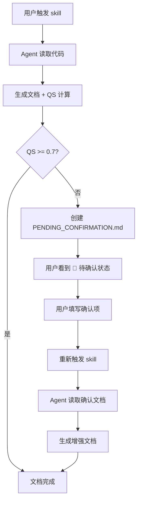
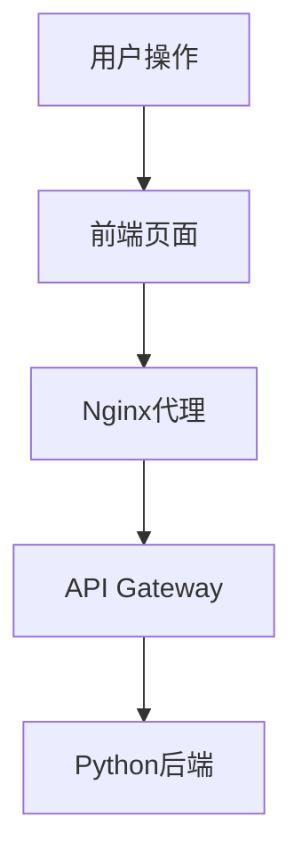
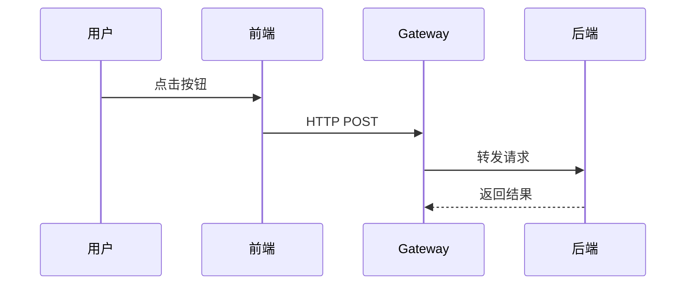
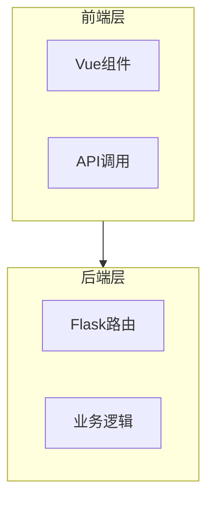

# Autodocs: 自动化文档生成规范

## 使命

为代码项目生成**可信**、**可追溯**、**可视化**的开发者文档——完全自动化，无需人工介入。

## 核心原则

**我们追求的不是「完整」，而是「诚实」「精确」与「可理解」**

- ✅ 仅从现有代码/配置提取信息，不编造
- ✅ 所有推测必须注明依据
- ✅ 每个段落标记可信度
- ✅ 每个代码引用包含精确链接
- ✅ 每个架构包含可视化图表
- ❌ 不需要人工介入即可完成初始文档

---

## 三大支柱

### 支柱 1: 段落级可信度标记系统（必须使用）

**每个内容段落都必须标记可信度：**

| 标记 | 含义 | 使用条件 | 示例 |
|------|------|----------|------|
| `[✅ 已验证]` | 代码已读取确认 | **必须引用具体代码行** | `[✅ 已验证] 调度器是消息队列循环（见 [main.cr:122](./src/main.cr#L122)）` |
| `[⚙️ 自动提取]` | 从配置/结构提取 | 从 package.json、YAML、目录结构提取 | `[⚙️ 自动提取] 依赖：kemal（从 shard.yml 提取）` |
| `[❓ 推测]` | 基于模式推测 | 看到部分代码但无法完全确认 | `[❓ 推测] 可能支持 WebSocket（见 [routes.cr:45](./src/routes.cr#L45)）` |
| `[🚫 未知]` | 无法确定 | 找不到相关代码或配置 | `[🚫 未知] 错误处理流程待确认` |

**`[✅ 已验证]` 的判断标准：**
- ✅ 你读了具体代码行，能引用它 → `[✅ 已验证]`
- ❌ 你大概扫了一眼，觉得是这样 → `[❓ 推测]`
- ❌ 你根据经验猜的 → `[❓ 推测]`

**宁可标 `[❓ 推测]` 也不虚假标 `[✅ 已验证]`。**

**段落级标记示例：**

```markdown
## 核心模块

[✅ 已验证] 调度器模块是一个循环处理消息队列的逻辑（见 [scheduler.cr:122](./src/scheduler.cr#L122)）。
代码结构如下：
\`\`\`crystal
loop do
  message = queue.receive()
  process(message)
end
\`\`\`

[⚙️ 自动提取] 依赖项列表：
- kemal (从 shard.yml 提取)
- redis (从 shard.yml 提取)

[❓ 推测] 可能支持消息重试机制（见 [queue.cr:45](./src/queue.cr#L45)），但未找到明确实现。

[🚫 未知] 以下内容无法从现有代码确定：
- 错误处理流程
- 性能瓶颈点
- 高可用方案
```

**自动化工作流原则：**
- ✅ 仅从现有代码/配置提取信息
- ✅ 所有推测必须注明依据
- ❌ 不编造无法验证的内容
- ❌ 不需要人工介入即可完成初始文档

### 人工确认文档机制

当自动化生成的文档可信度不足时（QS < 0.7），系统会自动创建人工确认文档：

**文件**: `.autodocs/PENDING_CONFIRMATION.md`

```markdown
# 📋 人工确认文档：项目架构说明

**状态**: 🔴 待确认
**创建时间**: 2026-03-26 14:30:00
**当前 QS**: 0.65

---

## 需确认项列表

### 🔴 高优先级（影响文档核心准确性）

- [ ] **消息队列重试机制**
  - 推测：可能支持重试（见 [queue.cr:45](./src/queue.cr#L45)）
  - 问题：未找到明确的重试次数和策略
  - 需确认：重试机制是否存在？具体策略是什么？

- [ ] **错误处理流程**
  - 推测：见 `rescue` 块（见 [handler.cr:78](./src/handler.cr#L78)）
  - 问题：错误分类和恢复策略不明确
  - 需确认：错误分级标准是什么？

### 🟡 中优先级（影响文档完整性）

- [ ] **性能瓶颈点**
  - 问题：无法从代码分析确定性能瓶颈
  - 需确认：已知性能问题点

---

## 确认后操作

1. 填写上述确认项
2. 重新运行 skill：`autodocs`
3. 系统将读取本文件并更新文档

---

**说明**: 自动化文档生成时无法确定以上内容，请人工确认后重新运行 skill。
```

**工作流：**



---

### 支柱 2: 精确代码链接系统（必须使用）

**所有代码引用必须指向项目根目录的源代码文件。** 链接前缀取决于文档位置：
- 文档在 `.autodocs/` 下 → `./src/...`
- 文档在 `.autodocs/sub/` 下 → `../src/...`
- 文档在 `.autodocs/a/b/` 下 → `../../src/...`

以下示例假设文档在 `.autodocs/` 目录（使用 `./` 前缀）：

#### 格式 1: 单行引用（文本内联）

```markdown
核心调度逻辑见 [scheduler.cr:122](./src/scheduler.cr#L122)
```

#### 格式 2: 行范围引用（表格索引）

```markdown
| 文件 | 行号 | 功能 |
|------|------|------|
| [main.cr](./src/main.cr#L10) | [L10-25](./src/main.cr#L10) | 初始化配置 |
| [api.ts](./src/api.ts#L44) | [L44-52](./src/api.ts#L44) | API 调用函数 |
```

#### 格式 3: 文件标题引用

```markdown
**文件**: [projects/eulermaker-cbs-web/src/page/projects/index.vue](./projects/eulermaker-cbs-web/src/page/projects/index.vue)

这是用户创建工程的入口...
```

**禁止模糊引用：**
- ❌ `在 scheduler.cr 中...`
- ❌ `scheduler 文件的某个函数`
- ❌ `根据代码分析...`（无链接）
- ✅ `[scheduler.cr:122](./src/scheduler.cr#L122)`

### 支柱 3: 可视化架构系统（必须使用）

**使用 Mermaid 图表增强可理解性：**

#### 流程图 (flowchart TD/TB/LR)



#### 时序图 (sequenceDiagram)



#### 架构图（带子图）



---

## 质量分数 (QS)

每次迭代后，运行 skill 目录中的 `verify.py` 计算 QS（不要复制到项目目录）。

### QS 计算公式

```
QS = w1×Structure + w2×Honesty + w3×Accessibility + w4×LinkValidity + w5×VisualQuality
```

| 维度 | 权重 | 检查项 |
|------|------|--------|
| Structure | 20% | 是否使用段落级可信度标记 |
| Honesty | 30% | 是否诚实标记未知内容（[🚫 未知]） |
| Accessibility | 15% | 是否有清晰的章节结构 |
| LinkValidity | 20% | 代码链接是否有效且准确 |
| VisualQuality | 15% | 是否包含 Mermaid 可视化图表 |

### QS 阈值与自动处理

- **QS >= 0.8**: ✅ 文档质量良好，完成
- **QS >= 0.7**: ⚠️ 文档质量一般，建议补充
- **QS < 0.7**: ❌ 文档质量不足，自动创建 `PENDING_CONFIRMATION.md`

### 自动触发人工确认

当 QS < 0.7 时，系统会：
1. 创建 `.autodocs/PENDING_CONFIRMATION.md`
2. 列出所有 `[🚫 未知]` 标记的内容
3. 等待用户填写确认信息后重新运行 skill

---

## 约束（Agent 不能做）

1. **不能创建未标记的内容** — 任何段落必须有可信度标记
2. **不能使用模糊代码引用** — 必须包含精确的文件路径和行号
3. **不能编造信息** — 无法从代码确认的内容必须标记为 `[🚫 未知]`
4. **不能假设环境** — 不要写"只需要运行 npm install"，除非确认了依赖
5. **不能忽略未知** — 如果不知道某些内容，用 `[🚫 未知]` 标记
6. **不能修改任何现有文件** — skill 文件（SKILL.md、references/、scripts/）和项目代码都是只读的，只生成 `.autodocs/` 下的新文件
7. **不能删除诚实标记** — 已标记为 `[❓ 推测]` 或 `[🚫 未知]` 的内容不能改为无标记
8. **不能缺少可视化** — 文档必须包含至少一个 Mermaid 图表
9. **不能等待人工确认** — 必须完成自动化文档生成，即使有未知内容
10. **不能虚假标 `[✅ 已验证]`** — 能引用具体代码行才标已验证，否则用 `[❓ 推测]`
11. **不能追求 QS 分数** — 诚实标记比高分更重要，不要为了分数改变可信度标记
12. **不能使用 git reset** — 会丢失用户未提交的修改，使用文件备份代替

---

## 成功指标

- QS >= 0.8：文档质量良好
- QS >= 0.7：文档质量可接受
- 段落级可信度标记覆盖率 100%
- 代码链接有效率 100%
- 可视化图表 ≥ 1 个

---

**记住：文档的价值在于「可信」、「可追溯」和「可理解」。每个代码引用都应该是可点击、可验证的，每个架构都应该是可视化的。**
