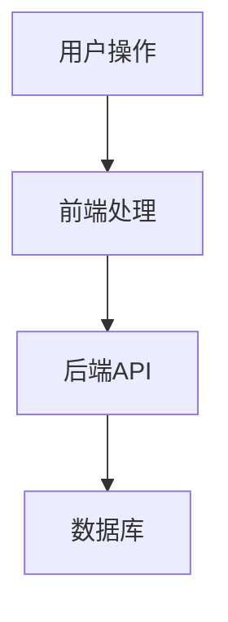
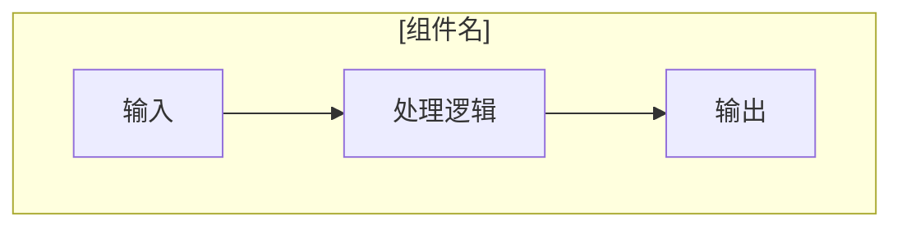
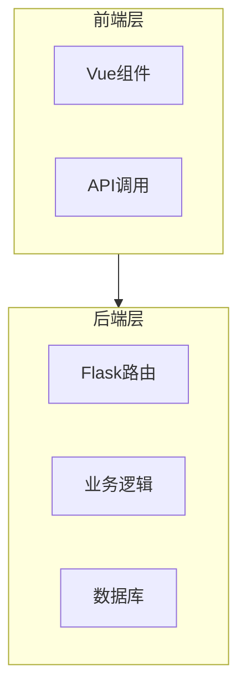
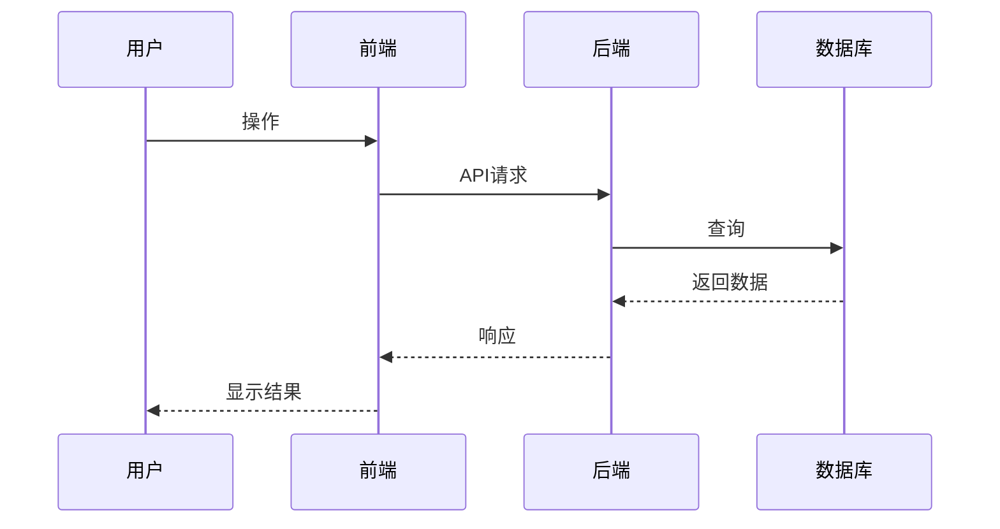

# Autodocs Document Templates

Templates for different types of documentation. Use these as starting points when generating docs.

## Template 1: Code Walkthrough (代码导读)

Use for: Deep dive into specific features, user flows, or complex logic.

```markdown
# [项目名] [功能名] 代码导读

> **目标**: 通过 [场景描述]，深入导读整个代码流程
> **创建时间**: YYYY-MM-DD
> **更新时间**: YYYY-MM-DD

## 目录

- [整体流程概览](#整体流程概览)
- [Phase 1: xxx](#phase-1-xxx)
- [Phase 2: xxx](#phase-2-xxx)
- [附录](#附录)

## 整体流程概览

[✅ 已验证] 整体流程如下（见 [main.cr:10](./src/main.cr#L10)）：



## Phase 1: [阶段名]

### 第 1 步：[步骤描述]

**文件**: [filename.ext](./path/to/filename.ext)

**关键代码位置**：

| 行号 | 功能 | 说明 |
|------|------|------|
| [L24-29](./path#L24) | xxx | xxx |

**核心代码**：

```language
// 从第 XX 行开始
代码片段...
```

[✅ 已验证] 这段代码实现了 [功能描述]（见 [filename.ext:XX](./path#LXX)）。

### 第 2 步：[步骤描述]

[⚙️ 自动提取] 配置项：
- xxx: yyy (从 config.yml 提取)

[❓ 推测] 可能支持 [功能]（见 [file.ext:XX](./path#LXX)），但未找到明确实现。

## Phase 2: [阶段名]

[✅ 已验证] [功能描述]（见 [file.ext:XX](./path#LXX)）。

## 附录

### 关键文件路径

| 文件 | 路径 | 说明 |
|------|------|------|
| 主入口 | [main.cr](./src/main.cr) | 应用启动 |
| 路由 | [routes.cr](./src/routes.cr) | API路由定义 |

### 依赖项

[⚙️ 自动提取] 从 shard.yml 提取：
- kemal: x.x.x
- redis: x.x.x

### 未知项

[🚫 未知] 以下内容无法从现有代码确定：
- 错误处理流程
- 性能瓶颈点
```

---

## Template 2: Component Documentation (组件文档)

Use for: Documenting individual components, modules, or classes.

```markdown
# [组件名] 组件文档

> **模块**: [模块路径]
> **创建时间**: YYYY-MM-DD

## 概述

[✅ 已验证] [组件名] 负责 [功能描述]（见 [component.ts:10](./src/components/component.ts#L10)）。

## 架构



## API

### 方法: [方法名]

**签名**: `method(param1: Type1, param2: Type2): ReturnType`

**位置**: [component.ts:XX](./src/components/component.ts#LXX)

**功能**: [功能描述]

**参数**:

| 参数 | 类型 | 说明 |
|------|------|------|
| param1 | Type1 | [说明] |

**返回值**: [返回值说明]

**示例**:

```typescript
const result = component.method(arg1, arg2);
```

[✅ 已验证] 该方法实现了 [功能]（见 [component.ts:XX](./src/components/component.ts#LXX)）。

### 属性: [属性名]

**类型**: Type

**位置**: [component.ts:XX](./src/components/component.ts#LXX)

**说明**: [属性说明]

## 使用场景

[✅ 已验证] 该组件用于 [场景描述]（见 [usage.ts:XX](./src/usage.ts#LXX)）。

## 依赖项

[⚙️ 自动提取] 依赖：
- [依赖1]: [版本]
- [依赖2]: [版本]

## 限制

[🚫 未知] 以下限制无法从代码确认：
- 性能限制
- 并发限制
```

---

## Template 3: Architecture Overview (架构概览)

Use for: High-level system architecture, data flow, or system design.

```markdown
# [项目名] 架构概览

> **创建时间**: YYYY-MM-DD

## 系统架构

[✅ 已验证] 系统采用 [架构模式]（见 [main.ts:10](./src/main.ts#L10)）。



## 数据流



## 核心模块

### [模块1]

[✅ 已验证] 负责 [功能]（见 [module1.ts:XX](./src/module1.ts#LXX)）。

### [模块2]

[✅ 已验证] 负责 [功能]（见 [module2.ts:XX](./src/module2.ts#LXX)）。

## 技术栈

[⚙️ 自动提取] 从 package.json 提取：
- 前端: Vue 3.x, TypeScript
- 后端: Flask 2.x, Python 3.9+
- 数据库: PostgreSQL 13.x

## 部署架构

[❓ 推测] 可能使用 [部署方式]（见 [docker-compose.yml:XX](./docker-compose.yml#LXX)），但未完全确认。

## 扩展点

[🚫 未知] 以下扩展点无法从代码确定：
- 插件机制
- 自定义钩子
```

---

## Template 4: API Documentation (API文档)

Use for: Documenting API endpoints, request/response formats.

```markdown
# [项目名] API 文档

> **Base URL**: [http://localhost:3000/api](http://localhost:3000/api)
> **创建时间**: YYYY-MM-DD

## 概述

[✅ 已验证] API 提供 [功能描述]（见 [routes.ts:10](./src/routes.ts#L10)）。

## 认证

[✅ 已验证] 使用 [认证方式]（见 [auth.ts:XX](./src/auth.ts#LXX)）。

## 端点列表

### POST /api/users

**功能**: 创建用户

**位置**: [routes.ts:XX](./src/routes.ts#LXX)

**请求头**:

| Header | 值 | 说明 |
|--------|-----|------|
| Content-Type | application/json | 请求体格式 |

**请求体**:

```json
{
  "name": "string",
  "email": "string"
}
```

**响应**:

```json
{
  "id": "number",
  "name": "string",
  "email": "string",
  "createdAt": "string"
}
```

**状态码**:

| 状态码 | 说明 |
|--------|------|
| 201 | 创建成功 |
| 400 | 请求参数错误 |
| 409 | 用户已存在 |

[✅ 已验证] 该端点实现了 [功能]（见 [routes.ts:XX](./src/routes.ts#LXX)）。

### GET /api/users/:id

**功能**: 获取用户信息

**位置**: [routes.ts:XX](./src/routes.ts#LXX)

**路径参数**:

| 参数 | 类型 | 说明 |
|------|------|------|
| id | number | 用户ID |

**响应**:

```json
{
  "id": "number",
  "name": "string",
  "email": "string"
}
```

**状态码**:

| 状态码 | 说明 |
|--------|------|
| 200 | 成功 |
| 404 | 用户不存在 |

[✅ 已验证] 该端点实现了 [功能]（见 [routes.ts:XX](./src/routes.ts#LXX)）。

## 错误处理

[✅ 已验证] 错误响应格式如下（见 [error-handler.ts:XX](./src/error-handler.ts#LXX)）：

```json
{
  "error": {
    "code": "string",
    "message": "string"
  }
}
```

## 速率限制

[🚫 未知] 速率限制策略无法从代码确认。
