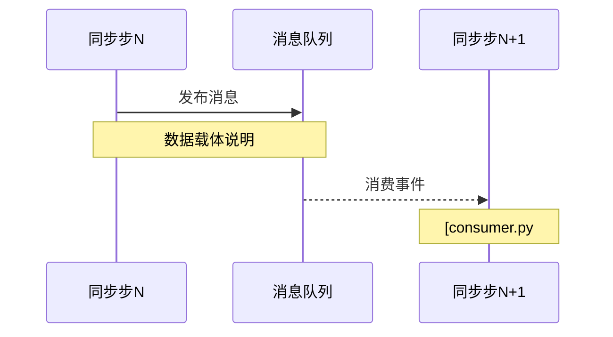

# Codoc — 持续演进的开源项目理解系统

## 概述

Codoc 不是文档生成器，而是一个**持续学习的项目理解系统**。它通过与用户的交互式采访、对源码的系统化探索，以及文档的持续迭代，帮助用户建立对任意开源项目的完整、准确、可验证的理解。

**核心理念**：
- 文档是"共同研究"的副产品，不是一次性产出
- 每一句论断都必须从源码可验证
- 不知道就是不知道，明确标注比猜测好
- 理解深度随用户背景动态校准

## 1. 目录结构

在项目根目录创建 `.codoc/` 隐藏目录：

```
.codoc/
├── index.md                     # 知识地图 + 覆盖状态 + 未确认项汇总
├── 01-profile.md                # 项目概况（基本稳定）
├── 02-concepts.md               # 核心概念（领域黑话解释）
├── user-context/
│   └── profile.md               # 用户知识背景（每人分支不同）
├── modules/                     # 模块分析（按项目实际生长）
│   ├── module-a.md
│   └── module-b.md
├── flows/                       # 流程分析（按业务场景生长）
│   ├── flow-1.md
│   └── flow-2.md
└── tradeoffs.md                 # 设计决策和妥协（可选，就近放也行）
```

## 2. 用户语言检测

### 2.1 自动检测

**不要采访用户用什么语言**。根据用户的输入内容自动判断：

| 用户输入特征 | 判定语言 |
|-------------|---------|
| 包含中文（汉字、中文标点） | 中文 |
| 仅含英文、日文、韩文等 | 对应的语言 |

检测到后记录到 `user-context/profile.md` 的 `language` 字段。

### 2.2 语言影响范围

语言偏好影响所有文档产出：

- 文档正文使用用户语言撰写
- 文档内的文字描述、注释、说明性文字使用用户语言
- 代码块内容保持原文（代码、标识符、路径、命令行等不翻译）
- Markdown 标题、表格文字、图示中的标注使用用户语言
- 目录导航、章节名称使用用户语言

### 2.3 语言切换

如果检测到用户在某轮会话中切换了语言（如之前用中文提问，这次用英文），**不要自动切换**文档的语言。必须明确询问用户是否要切换。如果用户没有选择切换，**仍然使用原来的语言**撰写文档，不受本次输入语言的影响。

必须明确询问用户：

> "我注意到你这轮用了英文，是否要把文档语言切换为英文？"

等用户确认后再切换，并在 `profile.md` 中更新记录。切换后后续内容按新语言撰写，已存在的文档不重写。

## 3. 每轮回话工作流

### Step 1: 加载

读取 `.codoc/` 目录中所有现有文档 + `user-context/profile.md`。

### Step 2: 采访

在开始探索前，先问用户：
- 本轮你想了解什么？有什么特别关心的方向？
- 上次的文档中哪里有不清楚的地方？

**不要问用户的技术背景和语言偏好**——语言从输入自动判断，技术背景在对话过程中自然发现。

如果 `profile.md` 已存在但信息有变化，更新它。如果没有，创建一份。

### Step 3: 确定探索范围

基于用户目标 + 现有文档中标记的未确认项，确定本轮探索目标。可以用户指定方向，也可以 skill 主动建议（如"你上次的文档中标记了几处 `❓` 未确认，要不要先解决这些？"）。

### Step 4: 探索

用工具探索源码。探索过程中保持**怀疑主义**：
- 每看到一个关键逻辑，问自己：这能从源码验证吗？
- 每看到一个设计决策，问自己：为什么这样做？不这样做的代价是什么？

### Step 5: 验证

**核心规则**：文档中的每一句论断都必须有源码锚点。
- 引用代码 → 提供文件路径和行号（`[file.py#L42]`）
- 描述行为 → 必须有代码位置支撑
- 描述依赖关系 → 必须有代码位置支撑

### Step 6: 写入/更新

就近更新对应文件：
- 模块相关内容 → `modules/module-name.md`
- 流程相关内容 → `flows/flow-name.md`
- 未确认项 → 在原文件标记，并在 `index.md` 中汇总引用

写入时遵循 [第 7 节：格式规范](#7-格式规范)。

### Step 7: 总结

本轮结束时：
- 更新 `index.md` 中的覆盖状态
- 更新 `user-context/profile.md`（记录了哪些新理解、发现了哪些 gap）
- 建议下一轮探索目标

## 4. 文档内容规范

### 4.1 目录导航

每篇文档（除 `index.md` 外）正文之前必须包含完整的目录导航：

```
## 目录

- [第 1 章：...](#第-1-章...)
  - [1.1 ...](#11-...)
  - [1.2 ...](#12-...)
- [第 2 章：...](#第-2-章...)
```

目录使用锚点链接，层级按文档实际结构缩进。章节式文档使用"第 N 章"编号，流程式文档使用 Phase/步骤编号。

### 4.2 必须覆盖的维度（针对每个分析对象）

| 维度 | 要求 | 示例 |
|------|------|------|
| 是什么 | 一句话定义，清晰定位 | "git-server 是 EulerMaker 的 Git 仓库镜像代理" |
| 为什么这样设计 | 分析设计动机和上下文 | "选择 Bare Clone 而非 Full Clone，因为节省空间且适合做镜像" |
| 如何做 | 代码级可追溯的执行过程 | 步骤 + 文件行号锚点 |
| trade-off | 替代方案对比，为什么选这个 | "etcd vs Redis：选了 etcd 因为…，代价是…" |
| 当前妥协 | 够用但不够优秀的地方 | "没有引用计数，仓库永不删除，磁盘只会增长" |

### 4.3 诚实标记体系

文档中遇到无法完全确认的情况，必须使用以下标记：

| 标记 | 含义 | 使用场景 |
|------|------|---------|
| `✅` | 已确认 | 能从源码完整 trace 到，逻辑闭合 |
| `🔗` | 需要外部信息 | 依赖外部模块/文档，当前无法判断 |
| `❓` | 待探索 | 逻辑存疑但还没深入验证 |
| `⚠️` | 不确定 | 有迹象但不够确信 |
| `🧱` | 已知无法追踪 | 异步/事件驱动导致链路断开 |

**❗ 铁律**：如果不能基于当前源码完全确定，**哪怕是一句话，都不该出现在文档中**。如果必须提及，就使用上述标记明确标注不确定性，并说明需要什么额外信息才能确认。

### 4.4 步骤间衔接要求（流程类文档）

**同步链路**：每一步末尾必须说明如何衔接到下一步，提供源码中的调用点（函数调用、HTTP 请求、消息发布、etcd 写入等）。

**异步链路**：使用 Async Bridge 模型（见 [第 8 节](#8-async-bridge-模型)）。

## 5. 格式规范

### 5.1 通用格式

- Markdown 格式，标题层级 `#` 到 `####`，不跳级
- 代码块必须标注语言类型（`python`、`ruby`、`go`、`bash`、`json`、`yaml` 等）
- 中文文档用中文标点，中英文之间加空格
- 文件路径使用基于仓库根目录的绝对路径（以 `/` 开头）

### 5.2 代码引用与文件链接

**核心要求**：所有引用代码的地方，必须提供可定位到源文件行级别的链接。

**文件链接格式**：

```markdown
[文件名#L行号](/基于仓库根目录的绝对路径#L行号)
```

- 使用基于仓库根目录的绝对路径链接（以 `/` 开头）
- 行号锚点只用单一起始行号 `#L85`，**不要用行号范围** `#L85-L115`（编辑器无法跳转）
- 如需标注行号范围，在正文表格或文字中说明，链接本身只指向起始行

**代码片段引用原则**：

1. **忠实原文**：引用的代码片段必须与源文件完全一致，**不得修改、重写、调整源代码内容**
2. **允许省略**：可以省略不关键的代码，使用注释标记省略处，例如：
   - `# ... 省略中间代码`
   - `# ... 日志记录`
   - `# ... 错误处理`
3. **允许添加注释**：可以在引用的代码中添加行内注释来解释关键逻辑，但必须明确区分原文和新增注释
4. **禁止机械展示**：避免大段直接复制粘贴代码而不做任何讲解，应该综合运用流程图、时序图、文字描述、表格对比等多种方式

**代码片段格式示例**：

```markdown
**文件**：[repo-manager.rb#L212](/projects/eulermaker-cbs/container/repo-manager/app/repo-manager.rb#L212)

```ruby
def check_to_create_repos
  loop do
    @job_id_info.clear           # 清理状态
    # ... 省略初始化代码
    
    extract_available_section    # 提取待处理的 job_section
    next if @job_id_info['job_section'].nil?  # 无任务则跳过
    
    # ... 省略后续处理逻辑
  end
end
```
```

**推荐：关键代码位置表格**（配合流程图使用，避免大段代码）：

```markdown
| 行号 | 功能 |
|------|------|
| 212-215 | 主循环入口，清理状态变量 |
| 218-221 | 提取待处理 job_section |
| 223-230 | 处理 RPM 链接和冲突清理 |
```

### 5.3 图示

所有文档必须综合运用图示辅助理解，禁止纯文字堆砌。

| 图类型 | 适用场景 | 使用 Mermaid |
|--------|---------|-------------|
| 架构图 | 模块位置、系统分层 | `mermaid flowchart TD` 或子图分组 |
| 流程图 | 执行逻辑、步骤顺序 | `mermaid flowchart` |
| 时序图 | 跨模块交互、请求链路 | `mermaid sequenceDiagram` |
| 状态图 | 状态流转、生命周期 | `mermaid stateDiagram-v2` |
| 关系图 | 数据模型、实体关系 | `mermaid erDiagram` |

**通用要求**：
- 架构图中标注模块名、编程语言、端口号
- 流程图中步骤/节点与正文中的步骤编号对应
- Phase 内部架构图用 Mermaid 子图（subgraph）分组

**禁止**：纯文字描述而不配图。至少每个核心流程配一个 mermaid 图。

### 5.4 数据结构展示

- 核心数据结构：用对应语言的代码块，字段加行内注释
- 状态枚举：表格列出枚举值和含义
- ES 索引：用 JSON 或 Python dict 格式，字段加行内注释

### 5.5 表格

- 表头加粗，使用 `|` 对齐
- 列数按信息需要合理设置，信息维度过多时考虑拆分多个表格

## 6. 文档类型

### 6.1 模块式

适用于功能清晰的单一模块。组织方式：

| 节 | 内容 |
|----|------|
| 模块定位 | 一句话说明角色和核心职责 |
| 系统架构位置 | 图示 + 标注语言和端口 |
| 技术栈 | 表格列出组件、版本、用途 |
| 目录结构 | 关键源码目录树 + 行内注释 |
| 核心 API / 核心流程 | 端点 + 流程步骤 + 响应示例 |
| 数据模型 | 核心字段定义 + 行内注释 |
| 环境配置 | 关键环境变量表 |
| 错误码 | 错误码 + 含义 |
| 与其他模块交互 | 模块 + 交互方式 + 用途 |
| 注意事项 | 重启影响 / 外部依赖 / 已知限制 |
| 未确认项 | 当前模块的 `❓` `🔗` `⚠️` |

### 6.2 章节式

适用于逻辑复杂的单一模块。以"章"为顶层组织单位：

| 章 | 内容 | 必选 |
|----|------|------|
| 第 1 章：整体架构篇 | 模块定位、架构位置图、核心职责 | 是 |
| 第 2 章：核心概念篇 | 关键领域概念、数据存储结构、状态枚举 | 是 |
| 第 3 章：代码详解篇 | 逐文件/逐类剖析，可定位链接 | 是 |
| 第 N 章：深度分析篇 | 并发安全、安全机制、核心问题等 | 否 |
| 最后一章：实战/部署篇 | 实战场景、K8s 部署、问题排查 | 是 |
| 附录 | A/B/C 按需 | 按需 |

### 6.3 流程式

适用于跨模块的业务流程。按步骤或 Phase 组织：

- 步骤少（<10）、无明确阶段 → 按步骤
- 步骤多、有阶段划分 → 按 Phase

每个步骤必须包含：
- **文件**：当前步骤的代码文件 + 行号
- **说明**：职责和关键逻辑
- **关键代码位置表**：行号范围 + 功能说明（配合图示）
- **衔接说明**：如何衔接到下一步

### 6.4 文档头部结构

每篇文档包含头部元信息：

```markdown
# <文档标题>

> **目标**: <端到端/模块的一句话描述>
> **最后更新**: 2026-05-09

## 目录

- [第 1 章：...](#第-1-章...)
  - [1.1 ...](#11-...)
```

## 7. Async Bridge 模型

用于描述异步、事件驱动、回调等不可直接追踪的衔接。

```
[同步步 N]
  ↓ 触发机制: HTTP POST / 消息发布 / etcd write / 回调注册
  ↓ 数据载体: 请求体 / 消息体 / etcd key / 回调参数
  ─── 🔗 Async Bridge ───
  ↓ 消费者: [consumer.py#L42]（文件+行号）
  ↓ 可追踪性: ✅ 已确认 / ⚠️ 部分确认 / ❓ 不可追踪
[同步步 N+1]
```

**对每个 Async Bridge 必须标注**：
1. 触发机制是什么？（怎么从同步步 N 出去的）
2. 数据载体是什么？（传输了什么信息）
3. 消费者在哪里？（谁在等这个事件，文件 + 行号）
4. 可追踪性等级，以及为什么是这个等级

如果确实无法追踪衔接，**必须**明确标注 `🧱 衔接不可追踪` 并说明原因，不得含糊跳过。

通过时序图辅助展示异步衔接的全貌：



## 8. 外部依赖处理

优先级梯级（从上到下，选能执行的最高级）：

1. **已在 skill 知识库中** → 可直接引用，标注所基于的版本
2. **版本已知 + 可拉源码** → 用 git subtree 拉到项目目录，做源码级分析
3. **用户能提供依赖源码/文档** → 分析用户提供的材料
4. **什么都没有** → 必须明确标注当前文档基于怎样的假设，不能做任何结论性推断

**外部依赖的结论性推断禁止**：文档不能包含"根据依赖 X 的行为，可以推断本项目 Y 功能的正确性"这类陈述。你只能描述本项目是怎么调用依赖的，不能替依赖的行为做担保。

## 9. 用户模型

`user-context/profile.md` 记录：

```yaml
用户:
  language: zh-CN        # 从用户输入自动判断，不采访
  技术背景:
    语言: [Go, Python, TypeScript]
    框架: [Flask, Gin, Vue 3]
    领域: [分布式系统, CI/CD, 容器]
  熟悉程度:
    相关领域: 高级
  session 记录:
    - 日期: 2026-05-09
      本轮目标: 理解 gateway 路由
      本轮理解: 完成了 gateway 的路由分析
      仍有疑问: ["反向代理的 ErrorHandler 设计"]
      覆盖模块: [gateway]
    - 日期: ...
```

每个用户一个分支。如果基于同一个分支交互，视为同一用户。不同用户拉不同分支维护各自 profile。

## 10. 文档质量检查

每次迭代结束时自我检查：

- [ ] 文档包含完整目录导航（锚点链接）
- [ ] 所有新增内容都有源码锚点（基于仓库根目录的绝对路径 + 行号）
- [ ] 代码引用忠实原文，没有修改源码内容
- [ ] 代码引用有适当的省略标记和行内注释
- [ ] 没有未经标记的猜测
- [ ] 所有 `❓` 和 `🔗` 都在 index.md 中汇总
- [ ] 至少核心流程配有 Mermaid 图示（流程图/时序图/状态图/架构图）
- [ ] 架构图标注了语言和端口
- [ ] 用户本轮提问中有没有暴露文档的 gap？如果有，已更新文档
- [ ] Async Bridge 的衔接标注完整
- [ ] trade-off 分析有覆盖"为什么"和"代价是什么"
- [ ] 文件路径使用基于仓库根目录的绝对路径
- [ ] 文档语言与用户语言一致

## 11. 判断"完全理解"的标准

用户的"完全理解"没有固定终点。判定标准：

1. 用户阅读对应文档后，没有提出新的疑问
2. skill 主动问"这部分还有不清楚的吗"后，用户确认理解
3. 文档中没有未解决的 `❓` 标记（对于该用户关心的范围）

如果用户提出疑问 → 说明文档存在 gap → 扩大探索范围或加深分析。