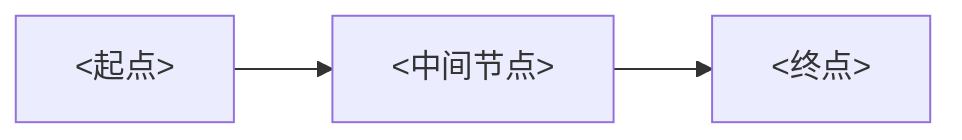
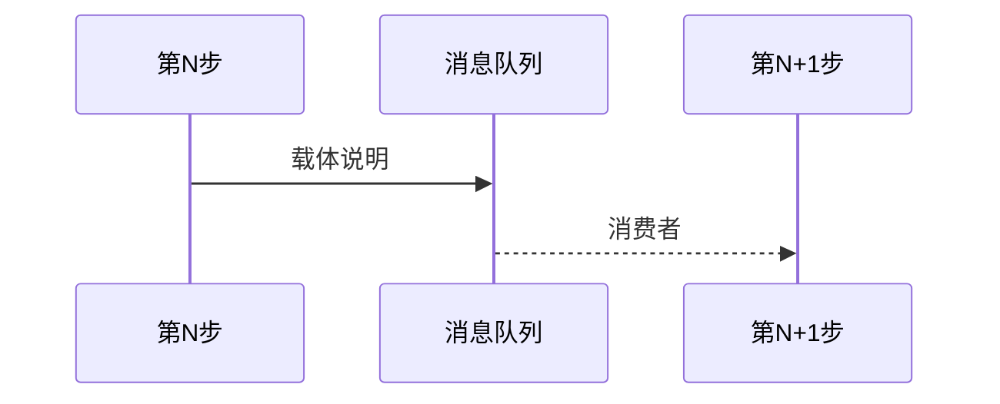
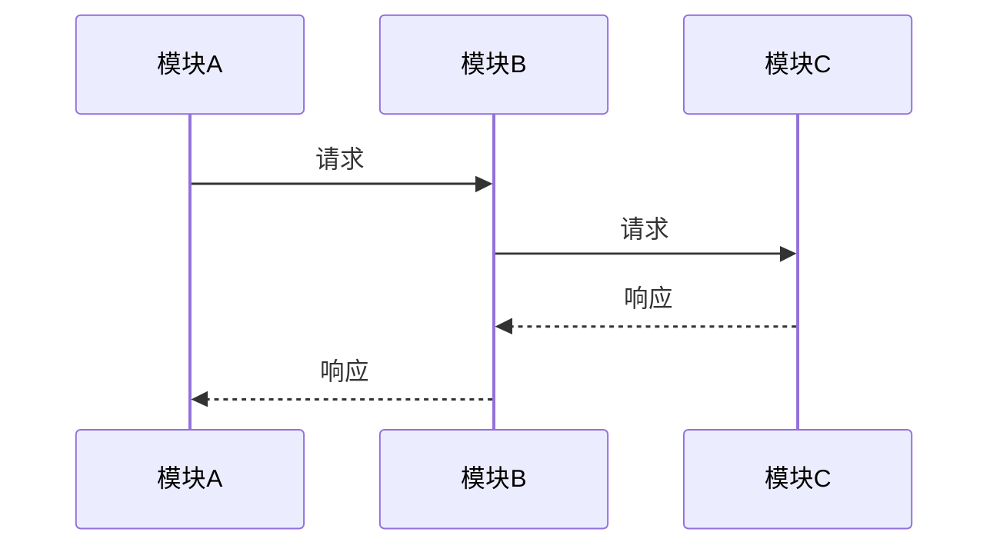

# <流程名>

> **目标**: <端到端流程的一句话描述>
> **最后更新**: <日期>

## 目录

- [整体流程概览](#整体流程概览)
- [核心数据模型](#核心数据模型)
- [导读路线](#导读路线)
  - [第 1 步：<步骤名>](#第-1-步步骤名)
  - [第 2 步：<步骤名>](#第-2-步步骤名)
- [完整数据流](#完整数据流)
- [未确认项](#未确认项)

## 整体流程概览



## 核心数据模型

<流程涉及的关键实体关系>

## 导读路线

### 第 1 步：<步骤名>

**文件**：[<文件名>#L<行号>](/基于仓库根目录的绝对路径#L<行号>)

<说明职责和关键逻辑>

**关键代码位置**：

| 行号 | 功能 |
|------|------|
| | |

**衔接说明**：<如何到下一步>

> 如果是异步链路，参考下方 Async Bridge 格式

```
[第 N 步: <名称>]
  ↓ 触发: <HTTP POST / 消息发布 / 回调>
  ↓ 载体: <数据内容>
  ─── 🔗 Async Bridge ───
  ↓ 消费者: [<文件名>#L<行号>]
  ↓ 可追踪性: ✅ / ⚠️ / ❓
[第 N+1 步: <名称>]
```

对应的时序图：



### 第 2 步：<步骤名>

...

## 完整数据流



## 未确认项

- `🔗` | `❓` | `⚠️`
