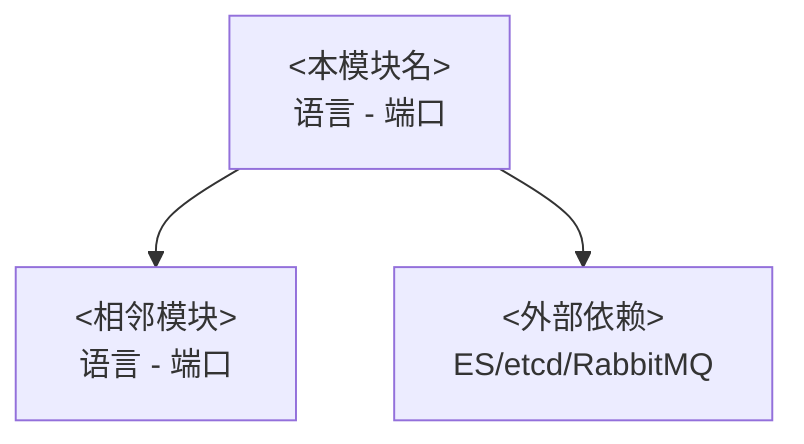

# <模块名>

> **目标**: <模块的一句话定位>
> **最后更新**: <日期>

## 目录

- [定位](#定位)
- [技术栈](#技术栈)
- [架构位置](#架构位置)
- [核心 API / 核心流程](#核心-api--核心流程)
- [数据模型](#数据模型)
- [关键设计决策](#关键设计决策)
- [未确认项](#未确认项)

## 定位

<在系统中的位置和核心职责>

## 技术栈

| 组件 | 技术/版本 | 说明 |
|------|----------|------|
| 语言 | | |
| 框架 | | |
| 数据存储 | | |

## 架构位置



## 核心 API / 核心流程

| 端点/流程 | 描述 | 源码位置 |
|-----------|------|---------|
| | | |

## 数据模型

```python
{
    "field": "value",  # 行内注释说明字段含义
}
```

## 关键设计决策

> 这个模块为什么这样设计？

**问题**：<设计问题>

**选择**：<当前方案>

**替代方案**：<其他选项>

**为什么选这个**：<理由>

**代价/妥协**：<当前方案的不足>

## 未确认项

- `❓` <疑问描述> → 需要进一步验证 [<文件>#L<行号>](/基于仓库根目录的绝对路径#L<行号>)
- `🔗` <需要的外部信息> → <所需的额外材料>
